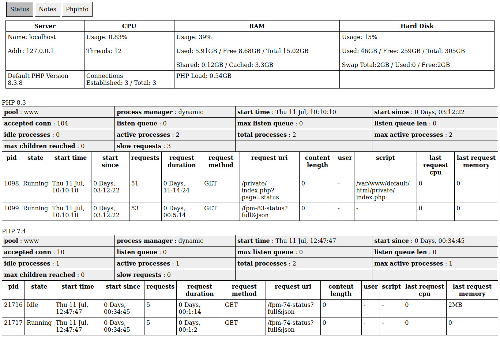

A Simple Status page to help monitor your Server and any PHP FPM pools.

There are many more complete server status options available,
 however I wanted to create something personal and light weight, which I might expand upon.

This displays a server resources overview and FPM pool status for multiple versions of PHP.
There is supposedly an HTML page supplied for the pool statuses, but I couldn't get it to work.

Here's a screenshot from a local installation, running php 8.3 and 7.4.  

All files should be in the same folder/url.

Currently, has a Status page and optional Notes and PHPInfo pages.

Make sure the FPM status option is enabled and responds, e.g. in > /etc/php/X.X/fpm/pool.d/www.conf

(see the serverNotes.html.php page for a few more details)

Written and tested on Debian/Ubuntu setups.

Author: John Day 